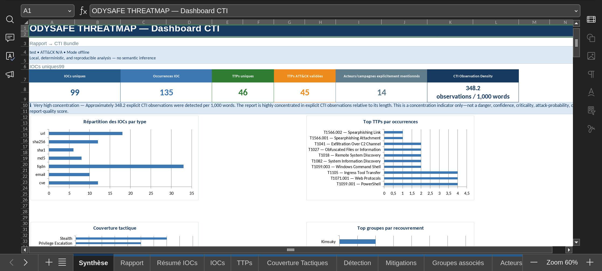

# 🛡️ Odysafe Threatmap

**Local, offline and deterministic Cyber Threat Intelligence analysis powered by MITRE ATT&CK.**

Odysafe Threatmap helps CTI analysts turn local threat reports into structured intelligence, Excel workbooks and MITRE ATT&CK views.

It is designed for analysts who want results that are:

* local
* explainable
* reproducible
* auditable
* ATT&CK-based
* easy to share

> **No LLM. No cloud analysis. No automatic threat attribution. No hidden guessing.**

---
## 📊 Example Excel Output

Odysafe Threatmap generates analyst-ready Excel workbooks with CTI dashboards, IOCs, MITRE ATT&CK techniques, tactics, detection information, mitigations and provenance.

<p align="center">
  
</p>


# ✨ What Odysafe Does

Odysafe can help you:

| You have                        | You want                                      | Use                                  |
| ------------------------------- | --------------------------------------------- | ------------------------------------ |
| One CTI report                  | Extract IOCs and explicit ATT&CK intelligence | `report build`                       |
| One threat actor                | Explore its ATT&CK knowledge                  | `actor snapshot`                     |
| Several actors                  | Compare techniques, software and campaigns    | `actor snapshot` with several actors |
| One industry sector             | Build a sector threat profile                 | `sector profile`                     |
| Many reports                    | Find repeated IOCs, TTPs and duplicates       | `aggregate`                          |
| A report + Sigma rules          | Find detection coverage and gaps              | `coverage sigma`                     |
| Actor/report/sector ATT&CK data | Generate Navigator layers                     | `navigator`                          |
| Local ATT&CK data               | Inspect or validate it                        | `data`                               |
| An Odysafe installation         | Check that everything works                   | `doctor`                             |

---

# 🔒 Main Principle: Offline Analysis

Odysafe works with local files.

Once the MITRE ATT&CK dataset has been installed:

```text
Local CTI report
       │
       ▼
    Odysafe
       │
       ▼
Local MITRE ATT&CK
       │
       ▼
Excel / Navigator output
```

Normal analysis does not need to send your CTI reports to a remote service.

Network access is mainly needed when you explicitly install or update MITRE ATT&CK data.

Odysafe announces network access before downloading ATT&CK.

---

# 🎯 No Semantic Guessing

Odysafe is intentionally conservative.

For example:

```text
PowerShell was executed.
```

does **not** automatically become:

```text
T1059.001
```

For Report analysis, the ATT&CK identifier must be explicitly present in the report.

Example:

```text
The activity was mapped to T1059.001.
```

Now Odysafe can validate and enrich that ATT&CK ID.

This makes the result easier to verify against the original report.

---

# 📦 Requirements

Recommended environment:

```text
Linux
Python 3.11+
Internet access for the initial ATT&CK download
```

Once ATT&CK is installed, the main CTI analysis workflows are designed to work locally.

---

# 🚀 Installation

## 1. Clone the repository

```bash
git clone https://github.com/YOUR-USERNAME/odysafe-threatmap.git
cd odysafe-threatmap
```

Replace the repository URL with the real Odysafe GitHub repository.

---

## 2. Make the helper scripts executable

If required:

```bash
chmod +x install.sh start.sh uninstall.sh
```

---

## 3. Install Odysafe

Run:

```bash
./install.sh
```

The installer creates the Python environment and installs the project dependencies.

Example:

```text
Odysafe ThreatMap
Private. Offline. Ready when you are.

Installing from current source tree…
Creating virtual environment at: .venv
```

The environment can also be activated manually with:

```bash
source .venv/bin/activate
```

---

# 🛡️ MITRE ATT&CK Setup

During installation, Odysafe asks which ATT&CK dataset you want to use.

Example:

```text
✦ MITRE ATT&CK DATA

1  ↻ Latest official dataset
2  ↓ Specific release
3  Set up later
```

For most users:

```text
1 — Latest official dataset
```

is the easiest choice.

Odysafe then asks before using the network.

Example:

```text
Network access is required once.
Download now? [Y/n]:
```

If you answer:

```text
Y
```

Odysafe downloads the official Enterprise ATT&CK STIX bundle, validates it and builds the local index.

After that, the dataset is stored locally.

---

# ▶️ Starting Odysafe

After installation, there are two easy ways to start the application.

## Method 1 — Start script

From the repository:

```bash
./start.sh
```

This is the simple launcher.

---

## Method 2 — Direct command

You can also run:

```bash
odysafe
```

This opens the interactive Odysafe menu.

You can also explicitly run:

```bash
odysafe interactive
```

---

# 🖥️ Interactive Mode

For most users, this is the recommended way to start.

```bash
odysafe
```

The main menu provides actions such as:

```text
[1] 🔎 Inspect MITRE data
[2] ↻  Update MITRE data
[3] ↓  Install a MITRE release
[4] ✦  Run analysis / generation
[5] ♥  Check installation health
[6] ×  Quit
```

Choose:

```text
4
```

to open the Analysis Studio.

---

# ✦ Analysis Studio

The guided Analysis Studio provides:

```text
[1] 📄 REPORT WORKBOOK

[2] 👤 ACTOR SNAPSHOT

[3] 🏢 SECTOR PROFILE

[4] 🗂 AGGREGATE REPORTS

[5] 🛡 SIGMA COVERAGE
```

The guided interface explains:

* what the function does
* what files you need
* optional information
* what will be generated
* important limitations
* available local files

This is useful if you do not want to remember CLI commands.

---

# 📁 Input Folders

Odysafe uses simple local folders for the guided interface.

```text
odysafe-input/
├── reports/
└── sigma/
```

---

## CTI reports

Put local CTI reports in:

```text
odysafe-input/reports/
```

Supported report formats include:

```text
.txt
.html
.htm
.pdf
.docx
```

Example:

```text
odysafe-input/
└── reports/
    ├── apt29-report.pdf
    ├── cert-alert.txt
    └── vendor-analysis.docx
```

---

## Sigma rules

Put Sigma rules in:

```text
odysafe-input/sigma/
```

Supported formats:

```text
.yml
.yaml
```

Example:

```text
odysafe-input/
└── sigma/
    ├── powershell.yml
    ├── suspicious_network.yml
    └── credential_dumping.yaml
```

---

# 📤 Output Folder

Generated files are normally written under:

```text
odysafe-output/
```

Example:

```text
odysafe-output/
├── report_vendor-analysis.xlsx
├── actor_APT29.xlsx
├── actor_comparison_*.xlsx
├── aggregate.xlsx
├── sigma_coverage_report.xlsx
├── navigator_actor-presence.json
└── sectors/
    └── sector_financial.xlsx
```

Odysafe avoids silently overwriting an existing analysis file.

---

# ⌨️ Essential Commands

To see all available commands:

```bash
odysafe --help
```

To check the installed version:

```bash
odysafe --version
```

---

# 📄 Report Analysis

## Basic command

```bash
odysafe report build report.txt
```

### What this does

Odysafe reads one local CTI report and extracts explicit intelligence.

It can identify information such as:

```text
IP addresses
domains
URLs
email addresses
hashes
CVEs
explicit MITRE ATT&CK IDs
explicitly identified ATT&CK actors
```

It then enriches valid ATT&CK IDs with the local ATT&CK dataset.

---

## Example

```bash
odysafe report build ./odysafe-input/reports/acme-incident.pdf
```

### Result

An Excel workbook containing information such as:

```text
📊 Executive dashboard
📄 Report information
🌐 IOC summary
🌐 IOC details
🎯 ATT&CK techniques
🗺 Tactic coverage
🔎 Detection information
🛡 Mitigations
👥 Related ATT&CK context
🔐 Provenance
```

---

# 📄 Report Metadata Options

Report analysis can also include analyst-provided metadata.

Examples include:

```text
report name
source / publisher
report date
TLP
confidence
output directory
```

A command can conceptually look like:

```bash
odysafe report build report.pdf \
  --name "September intrusion investigation" \
  --source "Internal SOC" \
  --date 2026-09-05 \
  --tlp AMBER \
  --confidence "High"
```

Use:

```bash
odysafe report build --help
```

to see the exact options supported by your installed version.

---

# 👤 Threat Actor Snapshot

Use this when you already know which threat group you want to investigate.

## Example with a group name

```bash
odysafe actor snapshot APT29
```

## Example with an ATT&CK group ID

```bash
odysafe actor snapshot G0016
```

Odysafe can resolve:

```text
ATT&CK group IDs
canonical group names
exact aliases
```

---

## What you get

The actor workbook can contain:

```text
👤 Actor identity
🏷 Aliases
🎯 Direct ATT&CK techniques
🧰 Software / malware
📅 Explicit campaigns
🌍 Local metadata when configured
📊 Dashboard
🔐 Provenance
```

---

# 👥 Compare Several Threat Actors

Pass several actors to the same command.

Example:

```bash
odysafe actor snapshot APT29 Kimsuky OilRig
```

### What this does

Odysafe creates a comparison workbook instead of a simple actor profile.

It can help compare:

```text
shared techniques
different techniques
software
campaigns
ATT&CK coverage
```

This is useful for CTI research.

It is **not** automatic threat attribution.

Odysafe does not say:

```text
Incident TTPs look like APT29
therefore APT29 caused the incident
```

---

# 🏢 Sector Threat Profile

Use this when you want to study threats relevant to a configured sector.

Example:

```bash
odysafe sector profile financial
```

You can also request several sectors:

```bash
odysafe sector profile financial energy technology
```

---

## What this uses

Sector profiles combine:

```text
local actor ↔ sector configuration
            +
MITRE ATT&CK group relationships
            +
ATT&CK techniques and tactics
```

---

## What you get

One Excel workbook per sector, with information such as:

```text
📊 Sector dashboard
👥 Relevant configured threat actors
🎯 ATT&CK techniques
🗺 Tactics
⚠ Priorities / risk information
🌍 Region information when configured
🔐 Provenance
```

### Important

Sector membership is not guessed from ATT&CK descriptions.

It comes from explicit Odysafe local configuration.

---

# 🗂 Aggregate Multiple Reports

Use Aggregate when you have several CTI reports.

Example directory:

```text
reports/
├── cert-fr.txt
├── microsoft-report.pdf
├── vendor-a.docx
└── vendor-b.html
```

Run:

```bash
odysafe aggregate ./reports
```

---

## What this does

Odysafe processes the reports together and can identify:

```text
number of reports
exact duplicate reports
unique IOCs
repeated IOCs
unique ATT&CK techniques
repeated ATT&CK techniques
source provenance
corroboration status
```

---

## Recursive scan

If your reports are inside subdirectories:

```bash
odysafe aggregate ./reports --recursive
```

Example structure:

```text
reports/
├── cert/
│   └── alert.txt
├── vendors/
│   ├── vendor1.pdf
│   └── vendor2.pdf
└── internal/
    └── incident.docx
```

`--recursive` tells Odysafe to scan subdirectories too.

---

# 🔗 Source Mapping and Corroboration

Several reports repeating the same information do not always represent several independent sources.

Example:

```text
CERT-FR
   │
   ├── copied by Blog A
   ├── copied by Blog B
   └── copied by Vendor Newsletter
```

That is still one original primary source.

Odysafe can use a source-mapping CSV.

Example:

```csv
file,primary_source
cert.txt,CERT-FR
blog-a.txt,CERT-FR
blog-b.txt,CERT-FR
microsoft.txt,Microsoft
```

Run:

```bash
odysafe aggregate ./reports --sources sources.csv
```

---

## Multi-source corroboration

Means:

```text
same evidence
+
at least two different primary sources
```

Example:

```text
T1071.001
├── CERT-FR
└── Microsoft
```

Result:

```text
MULTI-SOURCE
```

---

## False corroboration

Example:

```text
T1071.001
├── report-a.txt → CERT-FR
├── report-b.txt → CERT-FR
└── report-c.txt → CERT-FR
```

Three files exist, but the evidence comes from the same primary source.

Result:

```text
FALSE CORROBORATION
```

---

## Indeterminate

If source mapping is missing or incomplete:

```text
INDETERMINATE
```

Odysafe does not invent source independence.

---

# 🛡 Sigma Coverage

Use this when you want to compare CTI techniques with your local Sigma detection rules.

You need:

```text
one CTI report
+
one directory of Sigma rules
```

Example:

```bash
odysafe coverage sigma \
  ./odysafe-input/reports/report.txt \
  ./odysafe-input/sigma
```

---

## What this does

Example report:

```text
T1059.001
T1071.001
T1105
T1041
```

Example Sigma tags:

```text
attack.t1059.001
attack.t1071.001
```

Odysafe compares the explicit ATT&CK mappings.

---

## Output

The Excel workbook can show:

```text
🟢 Exact coverage
🟡 Partial coverage
🔴 Not covered
```

along with matching Sigma rules.

---

## Important

Odysafe does not inspect a Sigma title like:

```text
Suspicious PowerShell
```

and decide automatically:

```text
T1059.001
```

ATT&CK coverage is based on explicit Sigma ATT&CK tags.

---

# 🗺 ATT&CK Navigator

Odysafe can generate ATT&CK Navigator JSON layers.

Navigator is useful for:

```text
CTI presentations
SOC reviews
ATT&CK coverage
purple-team work
threat visualization
```

---

## Navigator from an actor

```bash
odysafe navigator actor APT29
```

This can create actor-focused layers such as:

```text
presence
frequency
mitigations
```

---

## Navigator from a report

```bash
odysafe navigator report report.txt
```

This creates layers from the explicit ATT&CK techniques in the report.

---

## Navigator from a sector

```bash
odysafe navigator sector financial
```

This creates sector-oriented ATT&CK layers.

Depending on the workflow, generated layers can represent:

```text
presence
frequency
mitigation
risk
```

---

# 🛡 MITRE ATT&CK Data Commands

Odysafe keeps ATT&CK locally.

To see the available data commands:

```bash
odysafe data --help
```

---

# 🔎 Check Installed ATT&CK Data

Run:

```bash
odysafe data status
```

This shows information such as:

```text
ATT&CK bundle path
source type
source reference
ATT&CK release
STIX version
mitreattack-python version
SHA-256
cache status
configuration hash
```

Use this when you want to know:

> Which exact ATT&CK dataset is Odysafe using?

---

# 🔬 Inspect ATT&CK Compatibility

Run:

```bash
odysafe data inspect
```

This provides deeper information about the installed bundle.

It can show information such as:

```text
compatibility status
STIX version
ATT&CK domain
object types
relationship types
detection model
schema/spec information
```

This is especially useful for debugging or validating a new ATT&CK release.

---

# ↻ Update MITRE ATT&CK

The easiest method is:

```bash
odysafe
```

Then choose:

```text
UPDATE MITRE DATA
```

Odysafe announces the network operation before downloading.

For direct command options, run:

```bash
odysafe data --help
```

and:

```bash
odysafe data update --help
```

---

# ↓ Install a Specific ATT&CK Release

You can also install a specific ATT&CK release.

The easiest method is through:

```bash
odysafe
```

then:

```text
INSTALL A MITRE RELEASE
```

Example release:

```text
19.2
```

For the exact direct-CLI syntax supported by the installed version:

```bash
odysafe data --help
```

---

# ♥ Installation Health Check

Run:

```bash
odysafe doctor
```

This verifies the main Odysafe environment.

Checks can include:

```text
Python
mitreattack-python
iocsearcher
txt2stix
XlsxWriter
STIX support
ATT&CK local data
technique lookup
group lookup
tactics
mitigations
detection strategy
data components
cache
configuration
Excel writing
Navigator support
```

If you are not sure whether your installation is healthy, this should be one of the first commands you run.

---

# 🔢 Version

Check Odysafe version:

```bash
odysafe --version
```

Example:

```text
1.1.0
```

---

# ❓ Help

Main help:

```bash
odysafe --help
```

Command-specific help:

```bash
odysafe report --help
```

```bash
odysafe report build --help
```

```bash
odysafe actor --help
```

```bash
odysafe actor snapshot --help
```

```bash
odysafe sector --help
```

```bash
odysafe sector profile --help
```

```bash
odysafe aggregate --help
```

```bash
odysafe coverage --help
```

```bash
odysafe navigator --help
```

```bash
odysafe data --help
```

These commands are the best way to see all flags supported by your installed version.

---

# 📌 Command Cheat Sheet

| Command                                    | What it does                                              | Main output            |
| ------------------------------------------ | --------------------------------------------------------- | ---------------------- |
| `./install.sh`                             | Install Odysafe and dependencies                          | Local environment      |
| `./start.sh`                               | Start Odysafe                                             | Interactive interface  |
| `./uninstall.sh`                           | Safely remove Odysafe environment/data after confirmation | Removal                |
| `odysafe`                                  | Open main interactive menu                                | Interactive UI         |
| `odysafe interactive`                      | Open interactive menu explicitly                          | Interactive UI         |
| `odysafe --version`                        | Show installed version                                    | Version                |
| `odysafe --help`                           | Show commands                                             | Help                   |
| `odysafe doctor`                           | Validate installation                                     | Health report          |
| `odysafe data status`                      | Show installed ATT&CK snapshot                            | ATT&CK status          |
| `odysafe data inspect`                     | Inspect ATT&CK capabilities                               | Compatibility report   |
| `odysafe report build FILE`                | Analyse one CTI report                                    | Excel workbook         |
| `odysafe actor snapshot ACTOR`             | Analyse one ATT&CK actor                                  | Excel workbook         |
| `odysafe actor snapshot A B`               | Compare several actors                                    | Comparison workbook    |
| `odysafe sector profile SECTOR`            | Build a sector threat profile                             | Excel workbook         |
| `odysafe aggregate DIR`                    | Aggregate multiple reports                                | Excel workbook         |
| `odysafe aggregate DIR --recursive`        | Include subdirectories                                    | Excel workbook         |
| `odysafe aggregate DIR --sources FILE.csv` | Add primary-source mapping                                | Corroboration workbook |
| `odysafe coverage sigma REPORT SIGMA_DIR`  | Compare TTPs with Sigma coverage                          | Excel workbook         |
| `odysafe navigator actor ACTOR`            | Build actor Navigator layers                              | JSON                   |
| `odysafe navigator report FILE`            | Build report Navigator layers                             | JSON                   |
| `odysafe navigator sector SECTOR`          | Build sector Navigator layers                             | JSON                   |

---

# 🧭 Which Command Should I Use?

## I received one threat report

Use:

```bash
odysafe report build report.pdf
```

You get:

```text
IOCs
ATT&CK TTPs
tactics
detection information
mitigations
provenance
Excel dashboard
```

---

## I want information about APT29

Use:

```bash
odysafe actor snapshot APT29
```

You get:

```text
aliases
direct TTPs
software
campaigns
actor workbook
```

---

## I want to compare APT29 and Kimsuky

Use:

```bash
odysafe actor snapshot APT29 Kimsuky
```

You get:

```text
multi-actor comparison workbook
```

---

## I work in the financial sector

Use:

```bash
odysafe sector profile financial
```

You get:

```text
configured relevant actors
ATT&CK techniques
tactics
risk/priorities
sector workbook
```

---

## I have 50 threat reports

Put them in:

```text
odysafe-input/reports/
```

Then:

```bash
odysafe aggregate ./odysafe-input/reports
```

You get:

```text
report inventory
duplicates
unique IOCs
repeated IOCs
unique TTPs
repeated TTPs
provenance
corroboration
```

---

## My reports are inside folders

Use:

```bash
odysafe aggregate ./reports --recursive
```

---

## I want to know if two vendors independently confirm an IOC

Create:

```text
sources.csv
```

Then:

```bash
odysafe aggregate ./reports --sources sources.csv
```

Odysafe can distinguish:

```text
MULTI-SOURCE
FALSE CORROBORATION
INDETERMINATE
```

---

## I want to know whether my Sigma rules cover a threat report

Use:

```bash
odysafe coverage sigma report.txt ./sigma
```

You get:

```text
exact coverage
partial coverage
not covered
matching rules
```

---

## I want a MITRE Navigator layer for an actor

Use:

```bash
odysafe navigator actor APT29
```

You get one or several:

```text
.json
```

Navigator layers.

---

## I want to check whether Odysafe is working correctly

Use:

```bash
odysafe doctor
```

---

## I want to know which ATT&CK version is installed

Use:

```bash
odysafe data status
```

---

# 🧠 Typical Analyst Workflows

## Workflow 1 — One report

```text
Vendor / CERT / Internal report
              │
              ▼
       REPORT WORKBOOK
              │
      ┌───────┼─────────┐
      │       │         │
     IOCs    TTPs     Actor context
              │
              ▼
       MITRE ATT&CK
              │
        ┌─────┴─────┐
        ▼           ▼
   Mitigations   Detection
```

---

## Workflow 2 — Several reports

```text
CERT
Vendor A
Vendor B
Internal SOC
Research report
     │
     ▼
AGGREGATE
     │
     ├── duplicates
     ├── repeated IOCs
     ├── repeated TTPs
     ├── primary sources
     └── corroboration
```

---

## Workflow 3 — CTI to Detection

```text
Threat report
     │
     ▼
Explicit ATT&CK IDs
     │
     ▼
Sigma rules
     │
     ▼
SIGMA COVERAGE
     │
     ├── exact
     ├── partial
     └── missing
```

---

# 📊 Excel Workbooks

Odysafe focuses heavily on analyst-friendly Excel output.

Depending on the workflow, workbooks can include:

```text
Dashboards
KPIs
Tables
Charts
IOCs
TTPs
Tactics
Actors
Software
Campaigns
Mitigations
Detection information
Risk / priorities
Corroboration
Provenance
```

Technical provenance is kept so analysts can understand which ATT&CK data and inputs were used.

---

# 🔐 Auditability and Provenance

Odysafe aims to make generated intelligence traceable.

Outputs can track information such as:

```text
Odysafe version
generation time
ATT&CK snapshot
ATT&CK SHA-256
configuration hash
input hashes
source information
```

This helps answer questions such as:

> Which ATT&CK dataset was used?

> Which report produced this IOC?

> Can I reproduce this analysis later?

---

# ⚠️ What Odysafe Does Not Do

Odysafe is not intended to be:

```text
an LLM assistant
a malware sandbox
a SIEM
a full Threat Intelligence Platform
an automatic attribution engine
an automatic semantic ATT&CK mapper
```

For example:

```text
PowerShell was used
```

does not automatically mean:

```text
T1059.001
```

And:

```text
These techniques look like APT29
```

does not mean:

```text
APT29 is the attacker
```

Odysafe prefers:

```text
UNKNOWN
N/A
INDETERMINATE
```

over unsupported conclusions.

---

# 🗑️ Uninstall

From the repository root:

```bash
./uninstall.sh
```

The removal script asks for confirmation before removing the Odysafe environment, settings, local data and caches.

Example:

```text
Odysafe ThreatMap
Safe removal

Remove Odysafe ThreatMap, environments, settings, data, and caches? [y/N]:
```

Be careful before answering:

```text
y
```

because local Odysafe data can be removed.

---

# 🔧 Troubleshooting

## `odysafe: command not found`

Try:

```bash
source .venv/bin/activate
```

then:

```bash
odysafe --version
```

You can also start with:

```bash
./start.sh
```

---

## ATT&CK is not installed

Run:

```bash
odysafe
```

and choose:

```text
INSTALL A MITRE RELEASE
```

or:

```text
UPDATE MITRE DATA
```

Then check:

```bash
odysafe data status
```

---

## Check everything

Run:

```bash
odysafe doctor
```

---

## No reports appear in the interactive selector

Check:

```bash
ls -lah odysafe-input/reports/
```

Supported report types:

```text
TXT
HTML
PDF
DOCX
```

---

## No Sigma rules appear

Check:

```bash
ls -lah odysafe-input/sigma/
```

Supported:

```text
.yml
.yaml
```

---

# ❤️ Acknowledgements

Odysafe Threatmap would not be possible without the work of the open-source cybersecurity community.

A special thank you to the developers, maintainers and contributors behind these projects.

### 🔎 iocsearcher

IOC and cyber-observable extraction from threat reports.

https://github.com/malicialab/iocsearcher

---

### 🛡 MITRE ATT&CK

The threat knowledge base used by Odysafe for techniques, tactics, groups, software, campaigns, mitigations and detection information.

https://attack.mitre.org/

---

### 🐍 mitreattack-python

Python tools used to work with MITRE ATT&CK STIX data.

https://github.com/mitre-attack/mitreattack-python

---

### 🔗 STIX

The Structured Threat Information Expression standard maintained through OASIS.

https://oasis-open.github.io/cti-documentation/

---

### 📄 txt2stix

Open-source tooling for converting CTI reports into structured STIX intelligence.

https://github.com/muchdogesec/txt2stix

---

### 🛡 Sigma

Open detection-rule format and ecosystem.

https://github.com/SigmaHQ/sigma

---

### 📊 XlsxWriter

Used to generate Excel workbooks, dashboards, tables and charts.

https://xlsxwriter.readthedocs.io/

---

### 🎨 Rich

Used for the terminal user interface.

https://rich.readthedocs.io/

---

### ⌨️ Typer

Used to build the command-line interface.

https://typer.tiangolo.com/

---

Thank you to every developer and contributor who shares tools, standards, data and knowledge with the cybersecurity community.

Odysafe does not replace these projects.

It brings them together into a local workflow focused on CTI analysts.

---

# Trademark Notice

MITRE ATT&CK® and ATT&CK® are registered trademarks of The MITRE Corporation.

Odysafe Threatmap is an independent project and is not affiliated with or endorsed by The MITRE Corporation, OASIS, MaliciaLab, DOGESEC, SigmaHQ or the maintainers of the projects listed above.

---

# 🛡️ Odysafe Threatmap

**Turn local threat reports into structured, auditable MITRE ATT&CK intelligence — without sending your reports to the cloud and without asking an AI to guess what they mean.**
s
